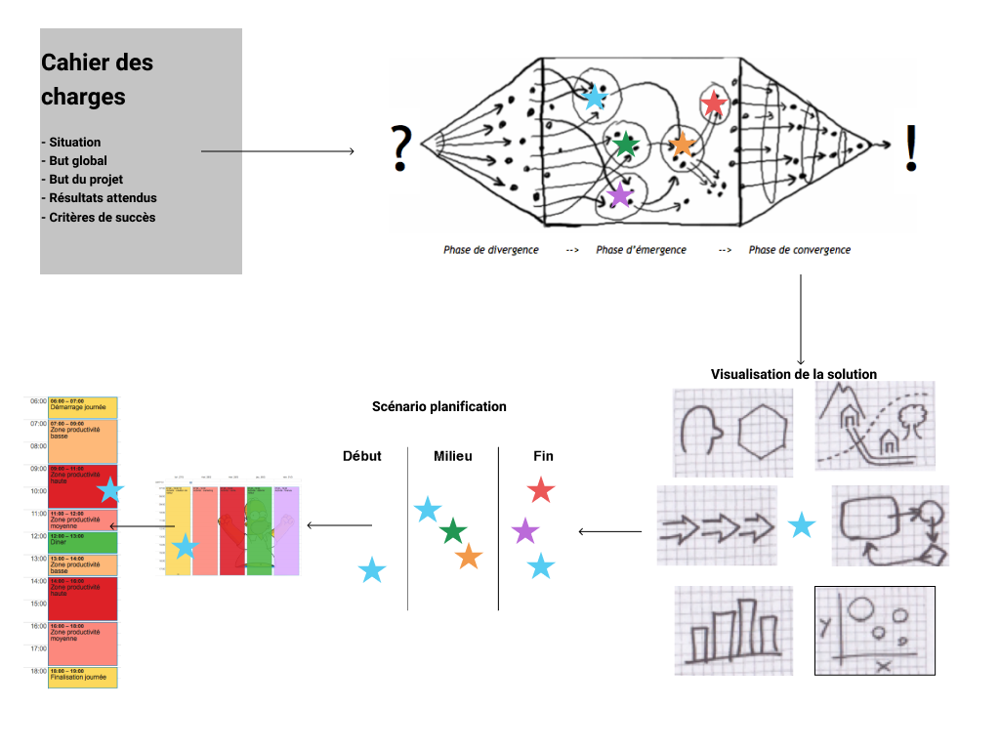

# faire : comment concrétiser des idées et monter les paliers de la productivité personnelle. » 

\newpage

\part{Introduction}

> *Penser est facile. Agir est difficile. Mais agir en accord avec sa pensée est le plus difficile de tout.*
   
 **Johann Wolfgang von Goethe**, écrivain allemand et esprit universel. 
 

\newpage

## Introduction 

Notre monde est instable, des changements se produisent drastiquement. Personne ne sait combien de temps quelque chose peut résister et quand la situation va radicalement changer. Les événements surviennent de façon inattendue. Dans le monde militaire est apparu l'acronyme VUCA qui signifie : volatility, uncertainty, complexity, ambiguity. L'activité humaine est marquée par l’inconstance, l’incertitude, la complexité et l’ambiguïté. L'environnement change constamment. Les nouvelles technologies apportent des réponses qui remettent en question l'existant. 

Dans ce contexte, chaque entrepreneur et entreprise est confronté à des défis au quotidien. Tous possèdent une certaine manière de les empoigner. Dans la majorité du temps cela fonctionne. Dans certaines situations, vous l'avez peut-être constaté, il y a un besoin d'acquérir des moyens supplémentaires pour résoudre des défis et concrétiser des idées.

En fait, c'est quoi une bone idée ? Tout d'abord, nous définissions une bonne idée par trois critères : simple, suprenante et pertinente. Et comment fait-on des idées ? C'est l'éclairage que cet ouvrable apportera. 

Avec ce livre, notre but est de vous apporter des éléments pour améliorer et compléter votre propre démarche pour générer et implémenter des idées - et non pas de la remplacer. 

 
Ce livre offre une approche structurée vous permettant de transformer les idées en succès.
Grâce à des chapitres synchronisés (et finement pensés), vous allez découvrir des outils pour identifier et définir des défis, générer des alternatives de solutions (des idées), les transformant en une forme visible (des prototypes) pour décider avec les autres de la meilleure solution. Planifier l'implémentation avec des outils efficaces et concrétiser votre solution avec des actions continues.

\newpage

### Les principes à respecter

Le livre que vous tenez entre vos mains est particulier, voici trois principes que vous devez respecter : 

1. Il ne se lit pas. Il est là pour que vous travaillez avec. C'est un outil pratique. Ecrivez dedans, renversez du café dessus - surtout utilisez-le ! 

2. Il est limité dans le temps. il y a une date de peremption, chaque livre convient pour 1 (un) projet ou défi spécifique - délimité dans le temps. 

3. Il est personnel. Vous n'avez pas le droit de l'offrir à votre grand-mère ou vos petits enfants. Achetez leur un autre. 

\newpage

Premier exercice : 
Commencez par noter votre nom, votre projet et délai d'implémentation sur la page suivante.
 
Ce livre appartient à :
(votre nom)

....................................................................................

Titre de votre projet :
(un titre court, compréhensible et mémorable)

....................................................................................

Courte description du projet :
(une description qui parle à tous)

....................................................................................

....................................................................................

....................................................................................

Date de péremption du projet
(un délai que vous pouvez visualiser, par exemple 90 jours)

....................................................................................

\newpage

### Vue d'ensemble du déroulement du livre

